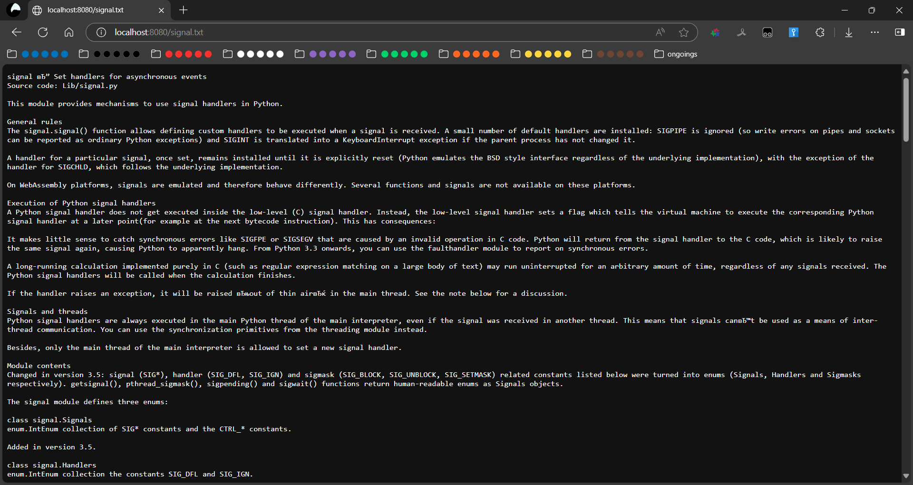
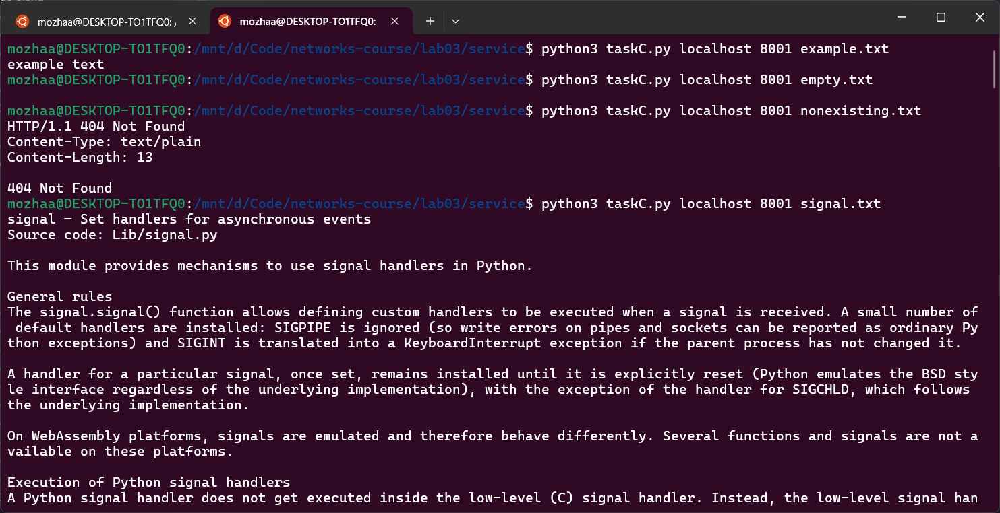

# Практика 3. Прикладной уровень

## Программирование сокетов. Веб-сервер

### <span style="color: limegreen">А. Однопоточный веб-сервер (3 балла)</span>
Вам необходимо разработать простой веб-сервер, который будет возвращать содержимое
локальных файлов по их имени. В этом задании сервер умеет обрабатывать только один запрос и
работает в однопоточном режиме. Язык программирования вы можете выбрать любой.
Требования:
- веб-сервер создает сокет соединения при контакте с клиентом (браузером) получает HTTP-запрос из этого соединения
- анализирует запрос, чтобы определить конкретный запрашиваемый файл
- находит запрошенный файл в своей локальной файловой системе
- создает ответное HTTP-сообщение, состоящее из содержимого запрошенного файла и предшествующих ему строк заголовков
- отправляет ответ через TCP-соединение обратно клиенту
- если браузер запрашивает файл, которого нет на веб-сервере, то сервер должен вернуть сообщение об ошибке «404 Not Found»

Ваша задача – разработать и запустить свой локальный веб-сервер, а затем проверить его
работу при помощи отправки запросов через браузер. Продемонстрируйте работу сервера, приложив скрины.

Скорее всего порт 80 у вас уже занят, поэтому вам необходимо использовать другой порт для
работы вашей программы.

Формат команды для запуска сервера:
```
<server.exe> server_port
```

#### Демонстрация работы
Сервер реализован в файле service/taskA.py. Запуск: `python taskA.py`

В папке files/ лежит 3 файла:
+ empty.txt - пустой файл

+ example.txt - небольшой текстовый файл

+ signal.txt - большой текстовый файл


Попробуем достучаться до невалидных путей:


### <span style="color: limegreen">Б. Многопоточный веб-сервер (2 балла)</span>
Реализуйте многопоточный сервер, который мог бы обслуживать несколько запросов
одновременно. Сначала создайте основной поток (процесс), в котором ваш модифицированный
сервер ожидает клиентов на определенном фиксированном порту. При получении запроса на
TCP-соединение от клиента он будет устанавливать это соединение через другой порт и
обслуживать запрос клиента в отдельном потоке. Таким образом, для каждой пары запрос-ответ
будет создаваться отдельное TCP-соединение в отдельном потоке.

#### Решение
Достаточно просто немного модифицировать сервер из предыдущего задания:
при получении запроса вместо
```
handle_request(client_socket)
```
будем создавать новый поток, и в нем запускать функцию:
```
thread = threading.Thread(target=handle_request, args=(client_socket,))
thread.start()
```

Теперь сервер на каждого клиента создает отдельный поток.
Покажем, что это правда работает:
1. Создадим FIFO в папке файлов, чтобы при доступе к ней, операция `open(...)` блокировалась бы
и зависала.

2. Запустим первый сервер и попробуем в одной вкладке постучаться в `fifo`, а в другой в существующий `example.txt`


Видим, что так как мы начали стучаться в файл, и поток заблокировался, мы не можем получить другой существующий файл

3. Теперь запустим второй сервер, и проделаем то же самое:


Теперь даже после зависания одного потока на открытии FIFO, мы можем получить доступ к другому файлу.

### <span style="color: limegreen">В. Клиент (2 балла)</span>
Вместо использования браузера напишите собственный HTTP-клиент для тестирования вашего
веб-сервера. Ваш клиент будет поддерживать работу с командной строкой, подключаться к
серверу с помощью TCP-соединения, отправлять ему HTTP-запрос с помощью метода GET и
отображать ответ сервера в качестве результата. Клиент должен будет в качестве входных
параметров принимать аргументы командной строки, определяющие IP-адрес или имя сервера,
порт сервера и имя файла на сервере. Продемонстрируйте работу клиента, приложив скрины. 

Формат команды для запуска клиента:
```
<client.exe> server_host server_port filename
```

#### Демонстрация работы
Клиент реализован в файле file/taskC.py. Проверим его работу:
1. Запустим сервер из предудыщего задания
2. Попробуем использовать клиент


В случае несуществующего файла, то есть когда ответ сервера не 200 OK, клиент завершается 
с ненулевым кодом возврата и выводи ответ сервера.

### Г. Ограничение потоков сервера (3 балла)
Пусть ресурсы вашего сервера ограничены и вы хотите контролировать максимальное количество
потоков, с которыми может работать ваш многопоточный сервер одновременно. При запуске
сервер получает целочисленное значение `concurrency_level` из командной строки. Если сервер 
получает запрос от клиента, и при этом уже запущено максимальное количество потоков, то 
запрос от клиента блокируется (встает в очередь) и дожидается, пока не закончит работу 
один из запущенных потоков. После этого сервер может запустить новый поток для обработки 
запроса от клиента.

Формат команды для запуска сервера:
```
<server.exe> server_port concurrency_level
```

## Задачи

### <span style="color: limegreen">Задача 1 (2 балла)</span>
Голосовые сообщения отправляются от хоста А к хосту Б в сети с коммутацией пакетов в режиме
реального времени. Хост А преобразует на лету аналоговый голосовой сигнал в цифровой поток
битов, имеющий скорость $128$ Кбит/с, и разбивает его на $56$-байтные пакеты. Хосты А и Б
соединены одной линией связи, в которой скорость передачи данных равна $1$ Мбит/с, а задержка
распространения составляет $5$ мс. Как только хост А собирает пакет, он посылает его на хост Б,
который, в свою очередь, при получении всего пакета преобразует биты в аналоговый сигнал.
Сколько времени проходит с момента создания бита (из исходного аналогового сигнала на хосте
A) до момента его декодирования (превращения в часть аналогового сигнала на хосте Б)?

#### Решение
1. Кодирование + декодирование
Скорость кодирования = $128$ Кбит/с, размер пакета = $56$ байт = $448$ бит. Тогда время
на декодирование пакета = $448 / 128000 = 0.0035 = 3.5$ мс.
2. Передача пакета по линии связи
$448 / 1000000 * 1000 + 5 = 5.448$ мс

Итого: $5.448 + 3.5 = 8.948$ мс.


### <span style="color: limegreen">Задача 2 (2 балла)</span>
Рассмотрим буфер маршрутизатора, где пакеты хранятся перед передачей их в исходящую линию
связи. В этой задаче вы будете использовать широко известную из теории массового
обслуживания (или теории очередей) формулу Литтла. Пусть $N$ равно среднему числу пакетов в
буфере плюс пакет, который передается в данный момент. Обозначим через $a$ скорость
поступления пакетов в буфер, а через $d$ – среднюю общую задержку (т.е. сумму задержек
ожидания и передачи), испытываемую пакетом. Согласно формуле Литтла $N = a \cdot d$.
Предположим, что в буфере содержится в среднем $10$ пакетов, а средняя задержка ожидания для
пакета равна $10$ мс. Скорость передачи по линии связи составляет $100$ пакетов в секунду.
Используя формулу Литтла, определите среднюю скорость поступления пакета в очередь,
предполагая, что потери пакетов отсутствуют.

#### Решение
Скорость передачи по линии связи составляет $100$ пакетов в секунду, а значит задержка передачи
равна $1/100$ с = $10$ мс. Тогда средняя общая задержка равна $10 + 10 = 20$ мс.

$N$ равно среднему числу пакетов в буфере плюс пакет, который передается в данный момент, то есть
$N = 10 + 1 = 11$ пакетов. Тогда по формуле Литтла: $11 = a \cdot 20$ мс, а значит 
$a = \frac{11}{0.02} = 550$ пакетов в секунду.

### Задача 3 (2 балла)
Рассмотрим рисунок.


Предположим, нам известно, что на маршруте от сервера до клиента узким местом
является первая линия связи, скорость передачи данных по которой равна $R_S$ бит/с.
Допустим, что мы отправляем два пакета друг за другом от сервера клиенту, и другой
трафик на маршруте отсутствует. Размер каждого пакета составляет $L$ бит, а скорость
распространения сигнала по обеим линиям равна $d_{\text{распространения}}$.
1. Какова временная разница прибытия пакетов к месту назначения? То есть, сколько
времени пройдет от момента получения клиентом последнего бита первого пакета до
момента получения последнего бита второго пакета?
2. Теперь предположим, что узким местом является вторая линия связи (то есть $R_C < R_S$).
Может ли второй пакет находиться во входном буфере, ожидая передачи во вторую
линию? Почему? Если предположить, что сервер отправляет второй пакет, спустя $T$ секунд
после отправки первого, то каково должно быть минимальное значение $T$, чтобы очередь
во вторую линию связи была нулевая? Обоснуйте ответ.

#### Решение
todo

### Задача 4 (4 балла)


На рисунке показана сеть организации, подключенная к Интернету:
Предположим, что средний размер объекта равен $850000$ бит, а средняя скорость
запросов от браузеров этой организации к веб-серверам составляет $16$ запросов в секунду.
Предположим также, что количество времени, прошедшее с момента, когда внешний
маршрутизатор организации пересылает запрос HTTP, до момента, пока он не получит
ответ, равно в среднем три секунды. Будем считать, что общее среднее время ответа
равно сумме средней задержки доступа (то есть, задержки от маршрутизатора в
Интернете до маршрутизатора организации) и средней задержки в Интернете. Для
средней задержки доступа используем формулу $\dfrac{\Delta}{1 - \Delta \cdot B}$, 
где $\Delta$ – это среднее время, необходимое для отправки объекта по каналу связи, 
а B – частота поступления объектов в линию связи.
1. Найдите $\Delta$ (это среднее время, необходимое для отправки объекта по каналу связи).
2. Найдите общее среднее время ответа.
3. Предположим, что в локальной сети организации присутствует кэширующий
сервер. Пусть коэффициент непопадания в кэш равен $0.4$. Найдите общее время ответа.

#### Решение
todo
