# Практика 9. Сетевой уровень

## Wireshark: ICMP
В лабораторной работе предлагается исследовать ряд аспектов протокола ICMP:
- ICMP-сообщения, генерируемые программой Ping
- ICMP-сообщения, генерируемые программой Traceroute
- Формат и содержимое ICMP-сообщения

### 1. Ping (4 балла)
Программа Ping на исходном хосте посылает пакет на целевой IP-адрес; если хост с этим адресом
активен, то программа Ping на нем откликается, отсылая ответный пакет хосту, инициировавшему
связь. Оба этих пакета Ping передаются по протоколу ICMP.

Выберите какой-либо хост, расположенный на другом континенте (например, в Америке или
Азии). Захватите с помощью Wireshark ICMP пакеты от утилиты ping.
Для этого из командной строки запустите команду (аргумент `-n 10` означает, что должно быть
отослано 10 ping-сообщений): `ping –n 10 host_name`

Для анализа пакетов в Wireshark введите строку icmp в области фильтрации вывода.

#### Вопросы

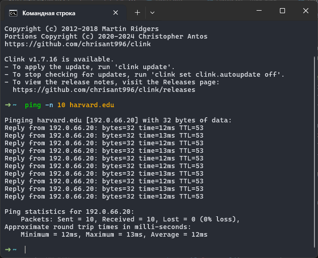

1. Каков IP-адрес вашего хоста? Каков IP-адрес хоста назначения?
   - 192..168.1.44

   
   - 129.0.66.20

   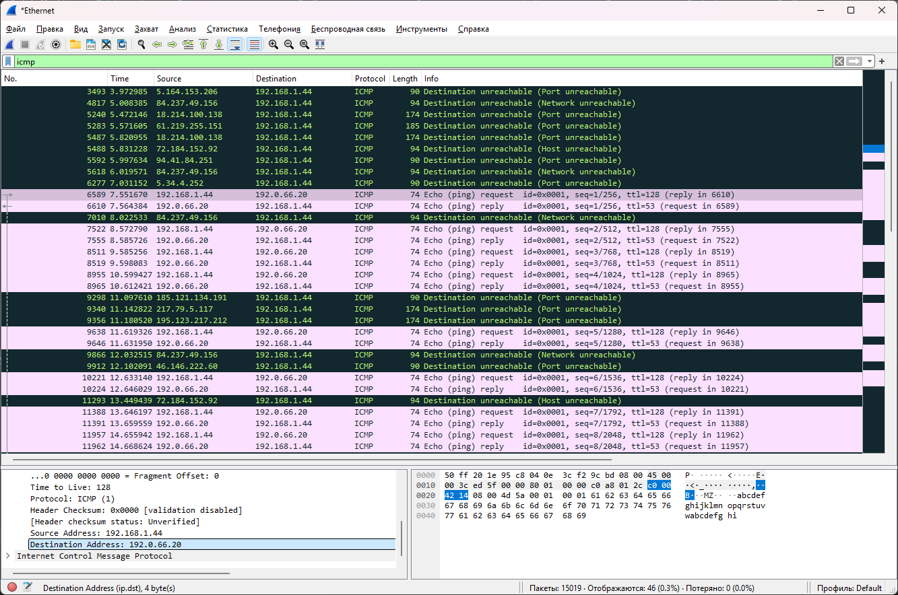
2. Почему ICMP-пакет не обладает номерами исходного и конечного портов?
   - Потому что он находится на сетевом уровне, а порты появляются на транспортном уровне (где TCP и UDP)
3. Рассмотрите один из ping-запросов, отправленных вашим хостом. Каковы ICMP-тип и кодовый
   номер этого пакета? Какие еще поля есть в этом ICMP-пакете? Сколько байт приходится на поля 
   контрольной суммы, порядкового номера и идентификатора?
   - Type: 8 (Echo (ping) request), Code: 0

   
   - Checksum, Identifier, Sequence Number
   - По 2 байта на каждый
4. Рассмотрите соответствующий ping-пакет, полученный в ответ на предыдущий. 
   Каковы ICMP-тип и кодовый номер этого пакета? Какие еще поля есть в этом ICMP-пакете? 
   Сколько байт приходится на поля контрольной суммы, порядкового номера и идентификатора?
   - Type: 0 (Echo (ping) reply), Code: 0

   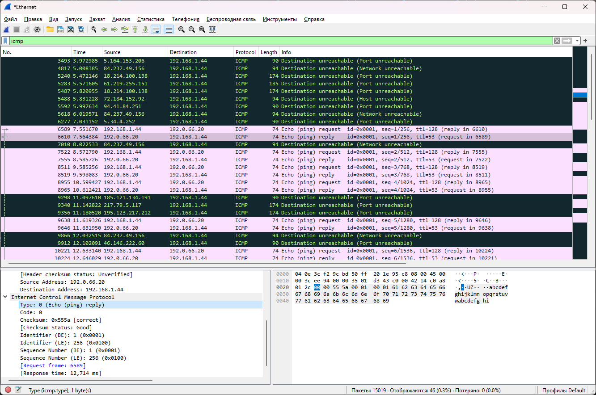
   - Те же самые Checksum, Identifier, Sequence Number
   - Опять по 2 байта на каждый

### 2. Traceroute (4 балла)
Программа Traceroute может применяться для определения пути, по которому пакет попал с
исходного на конечный хост.

Traceroute отсылает первый пакет со значением TTL = 1, второй – с TTL = 2 и т.д. Каждый
маршрутизатор понижает TTL-значение пакета, когда пакет проходит через этот маршрутизатор.
Когда на маршрутизатор приходит пакет со значением TTL = 1, этот маршрутизатор отправляет
обратно к источнику ICMP-пакет, свидетельствующий об ошибке.

Задача – захватить ICMP пакеты, инициированные программой traceroute, в сниффере Wireshark.
В ОС Windows вы можете запустить: `tracert host_name`

Выберите хост, который **расположен на другом континенте**.

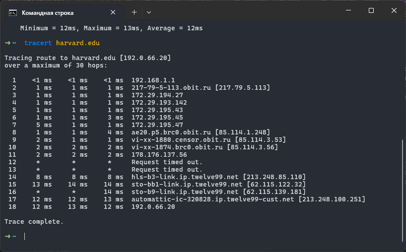
(harvard.edu расположен в Америке)

#### Вопросы
1. Рассмотрите ICMP-пакет с эхо-запросом на вашем скриншоте. Отличается ли он от ICMP-пакетов
   с ping-запросами из Задания 1 (Ping)? Если да – то как?
   - Похоже, что сам ICMP пакет не отличается от предыдущих, так же тип 8, код 0. Единственное, в IP части стоит TTL=1 вместо 128, и ICMP пакет выделен желтым, что означает, что ответа не пришло. Ответа не пришло, как раз потому что TTL=1 и пакет не успел дойти до Америки. А ещё часть Data заполнена нулями, а в прошлом пункте там были буквы алфавита `abcdefghi...` (и там было 32 байта данных, а тут 64).

   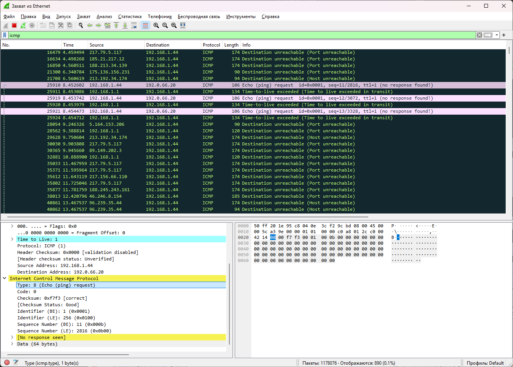
2. Рассмотрите на вашем скриншоте ICMP-пакет с сообщением об ошибке. В нем больше полей,
   чем в ICMP-пакете с эхо-запросом. Какая информация содержится в этих дополнительных полях?
   - В нём тоже есть Type, Code, Checksum, дальше идёт 4 байта unused (это вместо Identifier и Sequence Number), а потом идёт IP header из запроса и весь ICMP пакет запроса вместе с Data. То есть он отправил копию ICMP пакета запроса, чтобы мы сверили, на какой пакет от ответил Time-To-Live Exceeded

   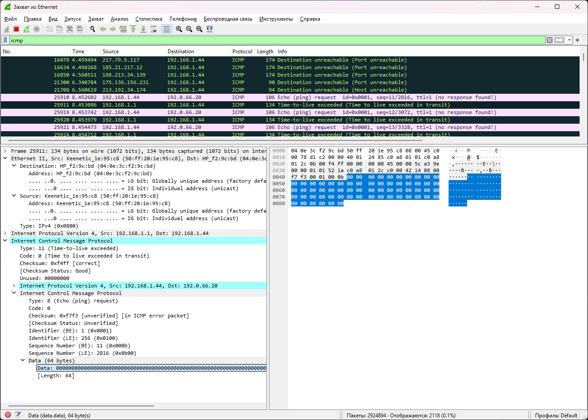
3. Рассмотрите три последних ICMP-пакета, полученных исходным хостом. Чем эти пакеты
   отличаются от ICMP-пакетов, сообщающих об ошибках? Чем объясняются такие отличия?
   - Они уже не с Type: 11 (Time-to-live exceeded), а с Type: 0 (Echo (ping) reply).

   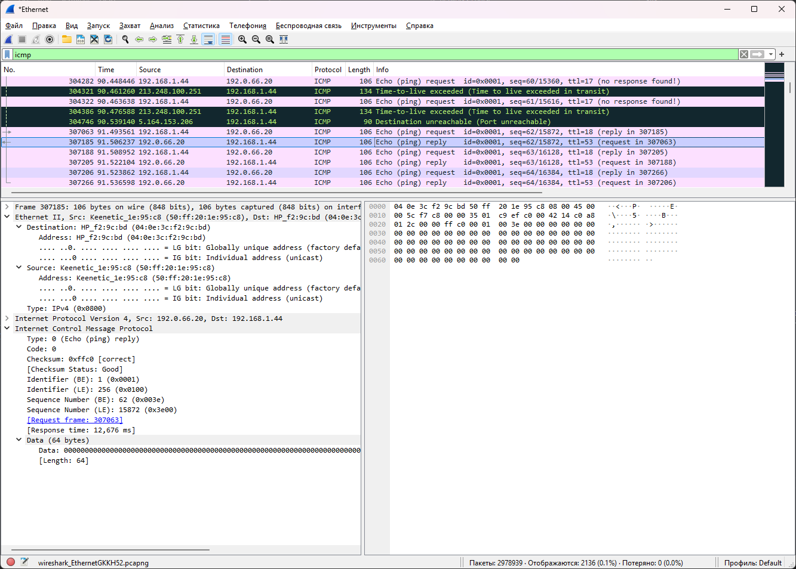
   - Это успешные ответы уже из сервера в Америке, потому что TTL=18 хватило, чтобы дойти до туда.
4. Есть ли такой канал, задержка в котором существенно превышает среднее значение? Можете
   ли вы, опираясь на имена маршрутизаторов, определить местоположение двух маршрутизаторов,
   расположенных на обоих концах этого канала?
   - У последних 5 хостов задержка больше 10 мс

   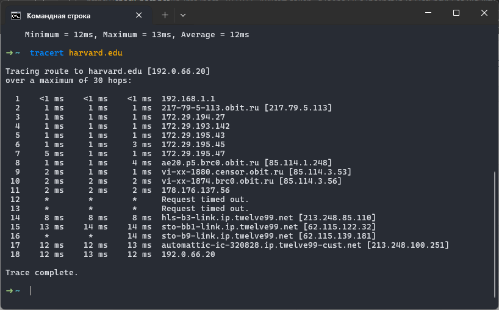
   - Я проверил все их на check-host.net, чтобы определить место (у двух из них там не нашлось информации), и оказалось, что: 1-й находится в Хельсинках, 2-й в Гамбурге, дальше 2 без информации, и последний уже в Сан-Франциско. Такие большие задержки, потому что между этими марштрутизаторами огромное расстояние.

   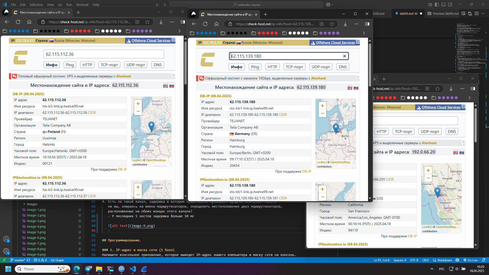

## Программирование.

### 1. IP-адрес и маска сети (1 балл)
Напишите консольное приложение, которое выведет IP-адрес вашего компьютера и маску сети на консоль.

#### Демонстрация работы
Код находится в `cli/ip-n-mask.py`. Он работает на обоих Windows и Linux

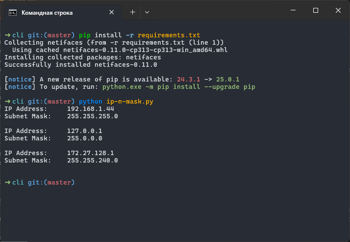
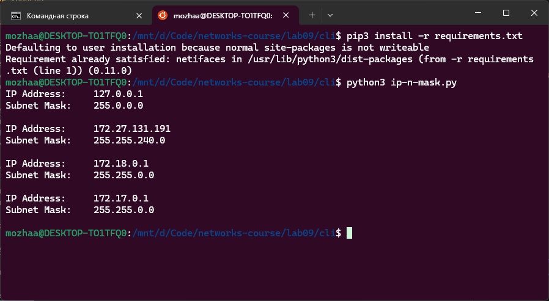

### 2. Доступные порты (2 балла)
Выведите все доступные (свободные) порты в указанном диапазоне для заданного IP-адреса. 
IP-адрес и диапазон портов должны передаваться в виде входных параметров.

#### Демонстрация работы
Код находится в `cli/scan-ports.py`. Для проверки я запустил сервис из lab02 на порту 8000, и из другого терминала запустил scan-ports.py на 127.0.0.1 по портам 7990-8010. В итоге получил порт 8000, как и ожидалось.

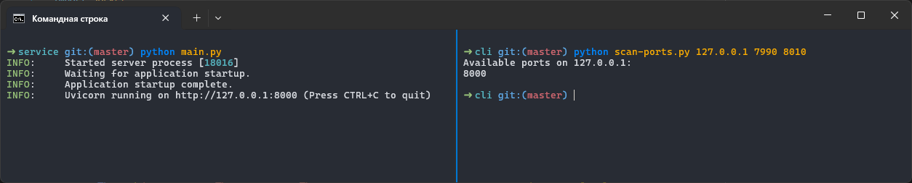

### 3. Широковещательная рассылка для подсчета копий приложения (6 баллов)
Разработать приложение, подсчитывающее количество копий себя, запущенных в локальной сети.
Приложение должно использовать набор сообщений, чтобы информировать другие приложения
о своем состоянии. После запуска приложение должно рассылать широковещательное сообщение
о том, что оно было запущено. Получив сообщение о запуске другого приложения, оно должно
сообщать этому приложению о том, что оно работает. Перед завершением работы приложение
должно информировать все известные приложения о том, что оно завершает работу. На экран
должен выводиться список IP адресов компьютеров (с указанием портов), на которых приложение
запущено.

Приложение считает другое приложение запущенным, если в течение промежутка времени,
равного нескольким интервалам между рассылками широковещательных сообщений, от него
пришло сообщение.

**Такое приложение может быть использовано, например, при наличии ограничения на
количество лицензионных копий программ.*

Пример GUI:

#### Демонстрация работы
todo

## Задачи. Работа протокола TCP

### Задача 1. Докажите формулы (3 балла)
Пусть за период времени, в который изменяется скорость соединения с $\frac{W}{2 \cdot RTT}$
до $\frac{W}{RTT}$, только один пакет был потерян (очень близко к концу периода).
1. Докажите, что частота потери $L$ (доля потерянных пакетов) равна
   $$L = \dfrac{1}{\frac{3}{8} W^2 + \frac{3}{4} W}$$
2. Используйте выше полученный результат, чтобы доказать, что, если частота потерь равна
   $L$, то средняя скорость приблизительно равна
   $$\approx \dfrac{1.22 \cdot MSS}{RTT \cdot \sqrt{L}}$$

#### Решение
todo

### Задача 2. Найдите функциональную зависимость (3 балла)
Рассмотрим модификацию алгоритма управления перегрузкой протокола TCP. Вместо
аддитивного увеличения, мы можем использовать мультипликативное увеличение. 
TCP-отправитель увеличивает размер своего окна в небольшую положительную 
константу $a$ ($a > 1$), как только получает верный ACK-пакет.
1. Найдите функциональную зависимость между частотой потерь $L$ и максимальным
размером окна перегрузки $W$.
2. Докажите, что для этого измененного протокола TCP, независимо от средней пропускной
способности, TCP-соединение всегда требуется одинаковое количество времени для
увеличения размера окна перегрузки с $\frac{W}{2}$ до $W$.

#### Решение
todo
